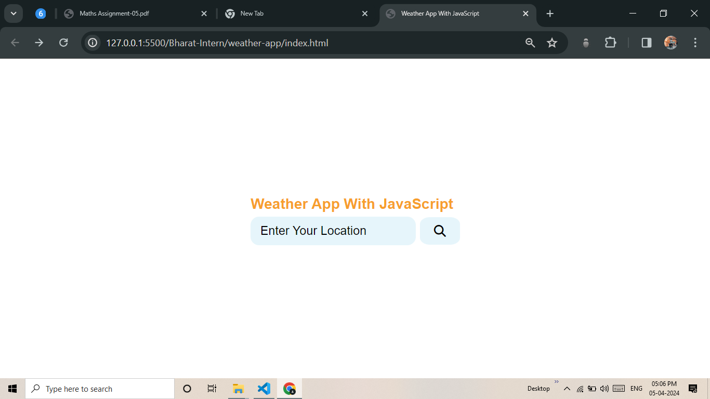
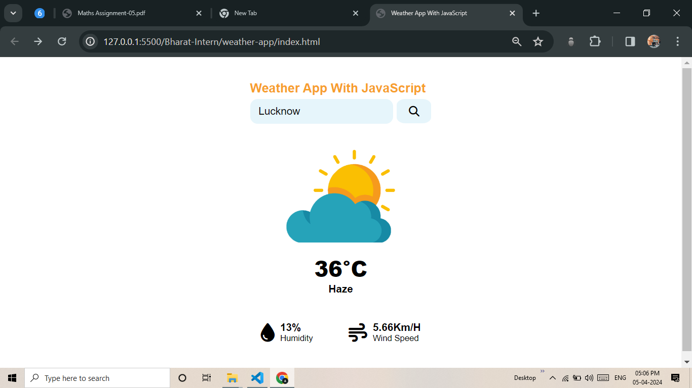
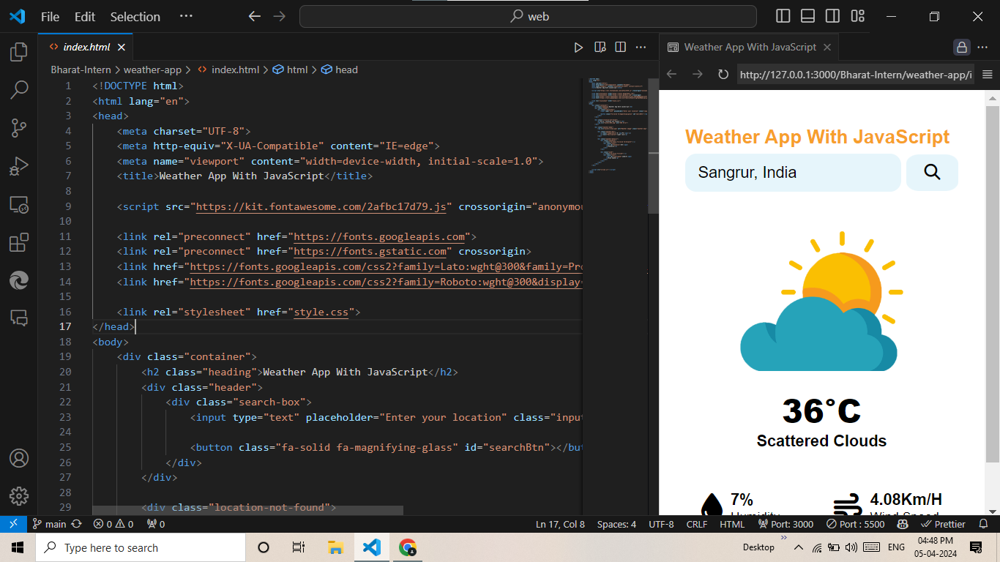

# Weather-app

This is a simple weather fetching website created as a task given by Bharat Intern.

## Description

This website allows users to fetch weather information for a specific location. It utilizes HTML, CSS, and JavaScript to create a user-friendly interface and interact with a weather API.

## Features

- User can enter a location to fetch weather information
- Weather information includes temperature, humidity, wind speed, and weather conditions
- User-friendly interface with responsive design
- Real-time updates of weather information

## Technologies Used

- HTML
- CSS
- JavaScript
- Weather API (e.g., OpenWeatherMap, Weatherbit, etc.)

## Installation

1. Clone the repository: `git clone https://github.com/eabhi-me/weather-app.git`
2. Open the `index.html` file in your web browser.

## Usage

1. Enter the location for which you want to fetch weather information.
2. Click the "Fetch Weather" button.
3. The weather information will be displayed on the screen.

## Example

Here is an example of how the website looks:

## Credits

This project was created as a task given by Bharat Intern. Special thanks to the mentors for their guidance and support.

## License

This project is licensed under the MIT License. See the [LICENSE](/path/to/LICENSE) file for more details.